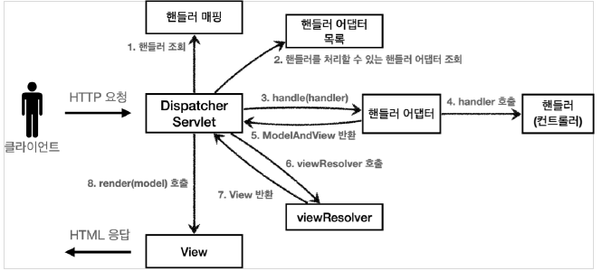

# Spring MVC

---

### MVC 패턴이란

모델-뷰-컨트롤러(Model-View-Controlle, MVC)는 소프트웨어 공학에서 사용되는 아키텍처 패턴으로 MVC 패턴의 주 목적은 Business logic과 Presentation logic을 분리하기 위함이다.

MVC 패턴을 사용하면, 사용자 인터페이스로부터 비지니스 로직을 분리하여 애플리케이션의 시각적 요소나 그 이면에서 실행되는 비지니스 로직을 서로 영향 없이 쉽게 고칠 수 있는 애플리케이션을 만들 수 있음 

````
Model : 애플리케이션의 정보(데이터, Business Logic 포함)
View : 사용자에게 제공할 화면(Presentation Logic)
Controller : Model과 View 사이의 상호 작용을 관리
````

### Spring MVC 구조

````
1. DispatcherServlet
다른 웹 프레임워크들에서 사용되는 Front Controller의 역할을 한다. 즉, 가장 앞단에서 클라이언트의 요청을 처리하는 Controller로써 요청부터 응답까지 전반적인 처리 과정을 통제한다.

2. Handler(Controller)
Spring MVC에서는 Controller=Handler(핸들러)라고 생각하면 편하다. 핸들러는 DispatcherServlet가 전달해준 HTTP 요청을 처리하고 결과를 Model에 저장한다.

3. ModelAndView
ModelAndView는 controller에 의해 반환된 Model과 View가 Wrapping 된 객체이다. 말 그대로 Model과 View가 같이 들어있는 객체라고 보면 된다.

4. ViewResolver
ViewResolver는 ModelAndView를 처리하여 View를 그리는 역할을 한다. Model에 저장된 데이터를 사용해 View를 그리고 사용자는 View를 보게 된다.
````

### Spring MVC 동작 구조



````
1. 핸들러 조회 : 핸들러 매핑을 통해 요청 URL에 매핑된 핸들러(컨트롤러)를 조회
2. 핸들러 어댑터 조회 : 핸들러를 실행할 수 있는 핸들러 어댑터를 조회한다.
3. 핸들러 어댑터 실행 : 핸들러 어댑터를 실행한다.
4. 핸들러 실행 : 핸들러 어댑터가 실제 핸들러를 실행한다.
5. ModelAndView 반환 : 핸들러 어댑터는 핸들러가 요청을 처리하고 반환하는 정보를 ModelAndView로 변환해서 반환한다.
6. viewResolver 호출 : viewResolver를 찾고 실행한다.
7. View반환 : viewResolver는 View의 논리 이름을 물리 이름으로 바꾸고, 렌더링 역할을 담당하는 View 객체를 반환한다.
8. View 렌더링 : View를 통해서 View를 렌더링한다.
````

